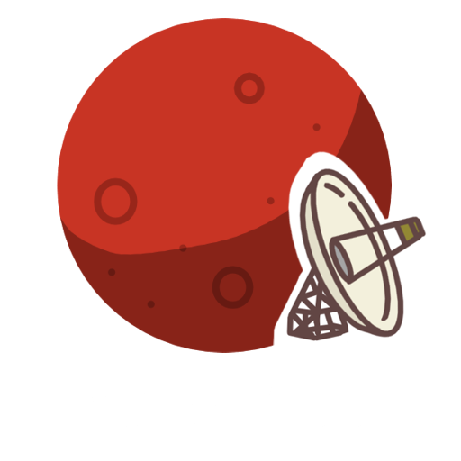

   

# Mars App
A full stack web application written in Spring Boot and Angular. The application uses a REST API to 
provide information about the planet Mars.

## Tech stack

### Frontend 

The frontend is written in Typescript using the Angular framework.

### Backend

The backend is written in Java using the Spring Framework.

### Database
For storage the app uses a PostgreSQL database.
